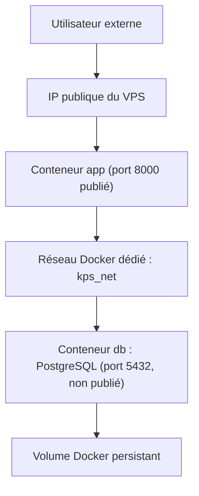

# Architecture

## Architecture Docker Compose actuelle

## Rôle de chaque service

- **`app`** : construit à partir du `Dockerfile` du projet (build multi-stage), exécute `init_db` puis démarre l'API FastAPI via `uvicorn` sur le port 8000.
- **`db`** : image officielle `postgres:16-alpine`, stocke les données dans le volume Docker `postgres_data`.

## Choix de sécurité

- PostgreSQL n'est jamais publié sur l'hôte (pas de section `ports` pour `db`).
- Les deux services communiquent uniquement via le réseau Docker dédié `kps_net`.
- Les secrets applicatifs (mot de passe PostgreSQL, `DATABASE_URL`...) sont injectés par variables d'environnement depuis `.env`, jamais en dur dans une image.
- Le conteneur applicatif tourne avec un utilisateur non-root (`appuser`), pas en `root`.

## Mode de lancement

Le projet utilise l'option A du brief (accès direct à l'application via Docker Compose sur le port 8000, par exemple `http://IP_DU_VPS:8000/health`) — suffisante pour l'objectif pédagogique de cette semaine. Une évolution possible serait d'ajouter Nginx devant le conteneur applicatif (option B, plus proche production) pour ne plus exposer directement le port de l'application.
